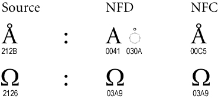

# Classifying-Names-with-a-Character-Level-RNN

Repo is implementation of this [beatiful tutorial from pytorch](https://pytorch.org/tutorials/intermediate/char_rnn_classification_tutorial). It is tweaked in a way that it is written in cpp ([using Eigen cpp](https://eigen.tuxfamily.org/index.php?title=Main_Page)) and custom cuda kernels. The main purpose of doing so is to learn the core architecture of `pytorch`, writing forward & backward pass of RNNs and cuda kernels. I landed on this tutorial while I was learning the first paper of [____](https://arc.net/folder/D0472A20-9C20-4D3F-B145-D2865C0A9FEE), the notebook llm said we needed attention blocks because of some drawbacks of [LSTMs](https://colah.github.io/posts/2015-08-Understanding-LSTMs/), which is just a variant of RNNs, then there are even variants of LSTMs, anyway so I had to learn RNNs. We will discuss the math behind `RNNs` and `LSTMs` some day else, if you are in hurry - [forward pass](https://karpathy.github.io/2015/05/21/rnn-effectiveness/) & [backprop for RNNs](https://youtu.be/OvCz1acvt-k?si=mc233ERWPjSp5Z2t).   
In future I will visit or come back
- to discuss the math behind RNNs and LSTMs
- implement LSTMs the same way I did for RNNs
- discuss the attention and augemented RNNs

--------------------------------------------

`git pull origin main`

--------------------------------------------
think of a neuron as a tree and go to the root